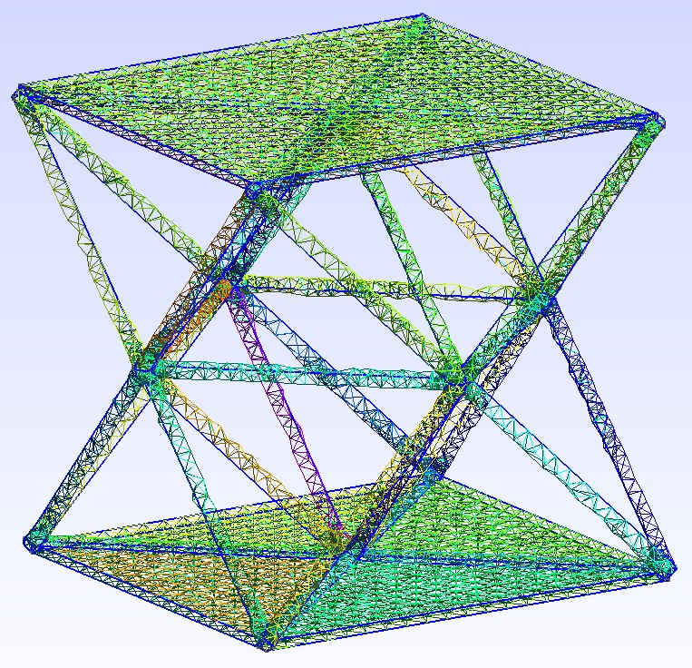

# installation

run the following command to install dependencies:

`conda env create -f environment.yml`

# scripts

* `generate_gmsh.py` will generate an octet truss sandwiched between two plates like this:

* `python run_sfepy.py linear_elasticity.py` will run a simulation where the octet mesh is subjected to a compressive strain
* `python run_postproc.py strut_test.vtk -b --only-names=u -d"u,plot_displacements,rel_scaling=1,color_kind='scalars',color_name='von_mises_stress'"` will postprocess the results to show von Mises stresses induced by the strain
* `python run_postproc.py strut_test.vtk -b --only-names=u -d"u,plot_displacements,rel_scaling=1,color_kind='vectors',color_name='cauchy_strain'"` will postprocess the results to show Cauchy strain in each element

* `sfepy_example.py` is an interactive python script which will calculate the von Mises stresses for several different strain values for generating a stress-strain curve
 